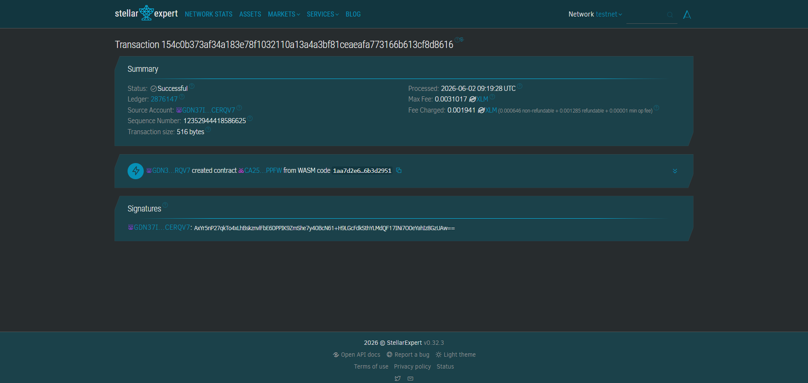

# Peer Review Reward

# Description
This project records peer-review actions on Stellar using a Soroban smart contract and provides a small off-chain Rust/Python-backed mirror for analytics and classroom tooling.

It exists to make peer-review incentives transparent, auditable, and tamper-resistant while enabling low-cost micro-rewards for reviewers.

# Project Vision
Build a lightweight, verifiable reward platform for classroom peer assessment where every review and reward allocation is traceable on-chain. Long-term, provide a reusable Stellar-native toolkit for assignments, badges, and reputation systems across courses.

# Features
- On-chain review registry (Soroban): store review records and emit events
- Simple on-chain reward ledger: admin can assign reward points to reviewer addresses
- Off-chain SQLite mirror for analytics and classroom UIs
- Small Python helper to initialize and inspect the local DB (`db/db_helper.py`)
- Deterministic storage and event publishing for easy auditing
- Admin-only controls for minting/marking rewards
- Validation for invalid inputs (e.g., score bounds)

# Getting Started
This section explains how to run tests, build the contract, and initialize the local DB for development.

Prerequisites:
- Rust toolchain and Cargo (on Windows install Visual C++ Build Tools / "Desktop development with C++")
- Python 3.8+ for the DB helper
- Optional: `stellar` CLI if you plan to deploy to testnet

Build & Test (PowerShell):
```powershell
cd learnReviewReward
# Run Rust unit tests for the contract crate
cargo test -p reviewReward

# Build WASM (release)
cargo build -p reviewReward --release --target wasm32-unknown-unknown
```

Build & Test (Bash):
```bash
cd learnReviewReward
export RUSTFLAGS='-C target-feature=+atomics,+bulk-memory,+mutable-globals'
cargo test -p reviewReward
cargo build -p reviewReward --release --target wasm32-unknown-unknown
```

Initialize local SQLite mirror (Python):
```bash
python db/db_helper.py
```

Quick test (inspect recent reviews):
```bash
python - <<'PY'
from db.db_helper import list_reviews
print(list_reviews())
PY
```

# Contract
Contract key: CA25GQJGTPXBQWW2XM3CA6Y2KCNDEZFO6BUSYOPNWVT4FHY7KJKMPPFW

Contract's screenshot



# Future scopes
- Add a frontend dashboard for instructors to review, approve, and reward reviews
- Integrate Google Sheets / LMS ingestion for submission mapping
- Add on-chain badge minting for verified reviewers
- Add meta-data and proof-of-workflow snapshots for stronger audit trails
- Add multi-admin roles and audit logging

# Profile
Name: To Thanh Dat
Skills: Rust, Soroban, Python, SQLite, smart contract design
Focus: Building classroom-facing Stellar dApps and low-friction incentive systems

